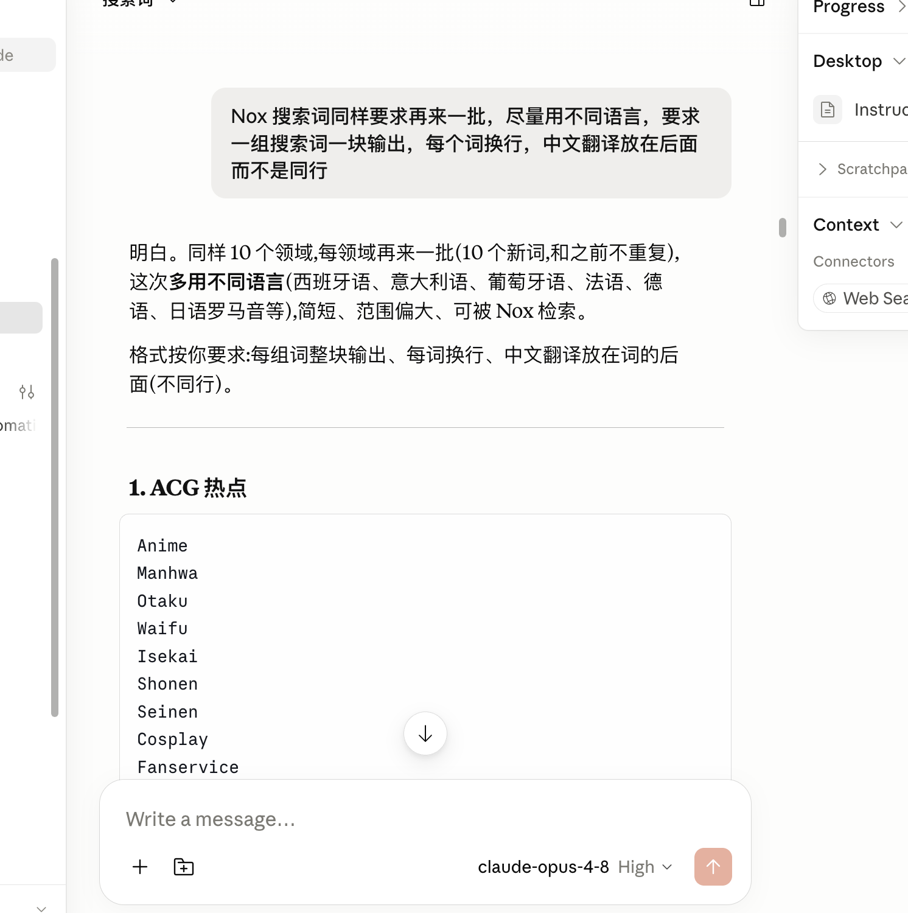
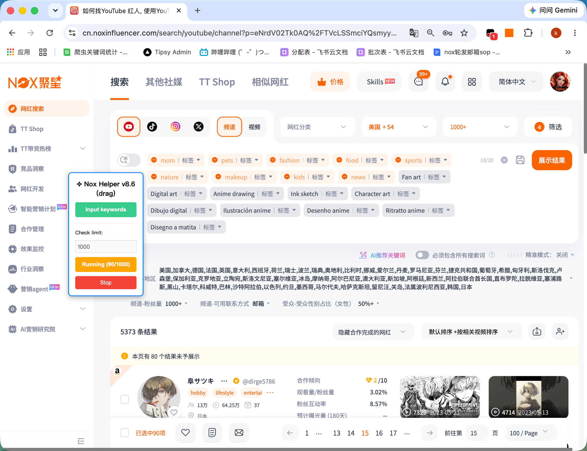

# NoxInfluencer Helper 油猴脚本

给 NoxInfluencer（Nox 聚星）网红开发流程用的自动化助手。装一次，之后自动更新，无需再手动复制粘贴代码。

---

## 一、安装地址

复制下面这条地址到浏览器地址栏，回车即可弹出安装页：

```
https://raw.githubusercontent.com/kevendeng/nox-/main/nox-helper.user.js
```

> ⚠️ 访问这个地址需要能正常打开 GitHub（部分网络环境需要科学上网）。如果页面打不开，是网络问题，不是脚本问题。

---

## 二、安装方法

### 第 1 步：安装 Tampermonkey（篡改猴）

如果浏览器还没装油猴插件，先去扩展商店搜索 **Tampermonkey** 安装。

### 第 2 步：打开 Chrome 开发者模式（第一次用油猴必做）

1. 地址栏输入 `chrome://extensions` 回车
2. 打开右上角的 **开发者模式（Developer mode）** 开关

### 第 3 步：允许 Tampermonkey 访问用户脚本

新版 Chrome 需要手动放开这个权限，否则脚本装不上或不生效：

1. 在 `chrome://extensions` 找到 **Tampermonkey**，点 **详情（Details）**
2. 打开 **允许用户脚本（Allow User Scripts）** 开关

### 第 4 步：安装脚本

把上面第一节的安装地址粘贴到浏览器地址栏回车，油猴会自动识别并弹出安装页面，点 **安装（Install）** 即可。

---

## 三、自动更新

装好后油猴会**自动检查更新**（默认每天一次），有新版本会提示你一键更新。也可以手动更新：

- 打开油猴面板 → 已安装脚本 → 点 **检查用户脚本更新**

脚本作者更新代码并提高版本号后，你这边就能收到更新提示，不用再手动换文件。

---

## 四、功能详解

脚本在以下 NoxInfluencer 页面自动生效，进入对应页面后**右下角会出现可拖动的操作面板**：

### 1. 网红搜索 / Lookalike 页面

进入搜索页面后，面板右下角会出现两个按钮：**Input keywords** 和 **Running**（自动选）。

#### 功能 A：关键词自动填入

点 **Input keywords** 弹出输入框，输入要搜的关键词。**格式要求**：每个关键词单独占一行，可混合搜索词和排除词（中文翻译放在后面，不同行）。



脚本工作逻辑：
- **清空灰色搜索词**、**保留橙色排除词**，然后逐行填入你的新关键词
- 每次搜索**读取一个关键词**（避免多词混入影响精准度）
- 然后发起搜索、等待结果加载

⚠️ **已知 Bug**：偶现网卡或网页加载慢时，脚本可能会把**第一个排除词改成搜索词**，导致搜索结果不准。症状是你的排除词列表少了一个。

#### 功能 B：自动选（批量勾选）

点 **Running** 弹出控制面板，可设置”Check limit”（目标数量，默认 1000），然后脚本会**自动全选、自动翻页**直到达到目标数量。



- 面板显示 `Running (n/limit)` 表示已勾选数量
- 点 **Stop** 随时停止

⚠️ **性能提示**：多个脚本同时运行（如多个浏览器标签页都开启自动选）会**大幅占用内存，容易导致浏览器卡死甚至崩溃**。建议同时只运行 1～2 个脚本；如果需要批量操作，推荐逐个进行。

---

### 2. 收藏夹 / 资源文件夹 页面

批量创建文件夹。填日期前缀和编号列表（格式 `编号 > 协作者1, 协作者2`，不写协作者就是私有），可先点”预览”确认名字再批量创建。

---

### 3. 邮件项目 页面

一键建项目 + 加收件人；可设次日零点定时任务。

---

### 4. CRM 详情列表 页面

筛选”建联中” → 自动设 100 条/页 → 逐页全选，可设目标数量。

进 CRM 列表页，面板里填目标数量，点”开始筛选+全选”。脚本会自动筛选”建联中”、把每页设成 100 条、逐页勾选，直到达到目标数量。计数以页面顶部”**已选 N 个网红**”为准（这是跨页累计的权威数字）。

---

### 通用操作

- **随时停止**：每个面板都有”停止”按钮，点了会中断当前批量任务。

---

## 五、常见问题

- **面板没出现？** 确认已在 NoxInfluencer 对应页面（搜索页 / CRM 列表页等），并刷新页面。
- **脚本装不上 / 不运行？** 回到第二节第 2、3 步，确认开发者模式和“允许用户脚本”都打开了。
- **数字对不上？** CRM 全选计数以网站顶部“已选 N 个网红”为准，这是跨页累计的真实值。
- **打不开安装地址？** 检查网络是否能访问 GitHub。

---

## 六、给维护者

- 权威版本就是本仓库 `nox-helper.user.js`，改动请提高文件头部的 `@version` 后推送，用户端才会收到更新提示。
